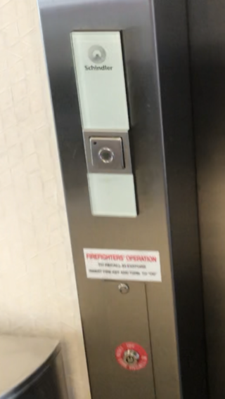
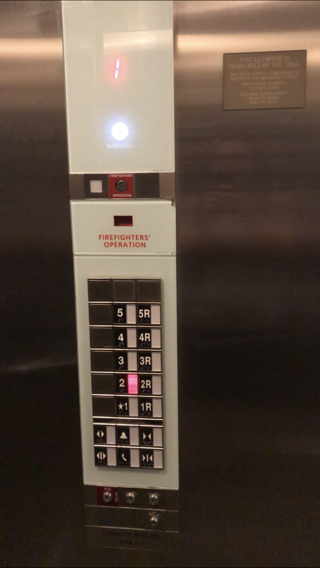
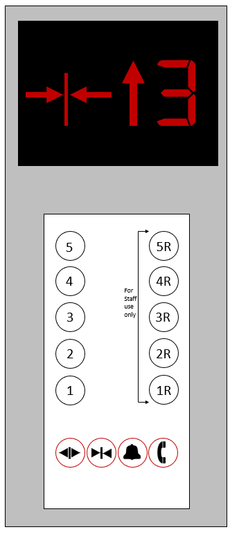

https://elozano2.github.io/HW1/

### Computer Human Interaction HW1  
#### Eduardo Lozano
---
  

Introduction
---

(Open in new tab)
[Demo](https://github.com/elozano2/HW1)

This assignment required me to visit an elevator and record myself using it.  
I was then required to find what is right and wrong with the current design  
of the elevator and see if I could come up with a better design. Finally,  
I was required to sketch my design and build a small application that  
shows that design in action. This readme will be split based on different criterea  
for each letter grade.

C Grade
===

This elevator was from a hotel, making its design important since it is being used every day.

While this elevator has some good design, there were a few things I found problematic. What I liked  
about this design was the feedback the panel gave when a button was pressed. When a button is pressed, the button  
turns on. This can be helpful since this sort of feedback shows the user that the elevator recognizes  
the button being pressed.

What I found problematic in the design of the panel, was the layout of the buttons. There is a second  
set of buttons for each floor labeld with an "R". These buttons are for the staff to use and gain access 
the second set of doors on the other side of the elevator.  
This can be confusing since not all users may know this information and can mistakenly  
press the wrong button. I also thoguht that while nice looking, the screen that indicates the current  
floor should be black so that it may be easier to see the light. If the led that indicates the current floor  
goes dim, it may become  difficult to see. Another problem with the panel was the two sets of buttons to open  
and close the door. It is hard to tell which button opens which door and can confuse people using the elevator.
Finally, The elevator beeps when you arrive to your floor. While this is useful, I believe this design can be improved.

B Grade
===

With my new design, I prioritized feedback and minimalism. I believe this new design is unique since it prioritizes  
user friendliness to reduce confusion when being used. This means users will find it easy to operate the elevator and prevent  
them from getting lost while trying to get to their hotel room.

As you can see, I decided to seperate the buttons for the guests and the buttons for the staff into two different sections.
In addition, I added a label to show that the buttons with an "R" are for staff use only. This will show guests that
those buttons should not be pressed. I also added the open, close, alarm, and call buttons at the bottom of the panel with  
a red outline. This red outline shows people that those buttons are for emergency purposes and are not meant to be  
used when trying to get to a desired floor. I removed the second set of open and close buttons and made the first set
of buttons control both doors. This will prevent the number of buttons on the panel and make the overall look cleaner. 
Instead of having the beep go off when the elevator arrives to a floor, It would be more benificial to have a voice  
go off and say what floor the elevator is stopping in. This can help blind people navigate when they operate the elevator.
Phisically, I decided to move the panel slighly lower to accomodate people in a wheelchair. This will make it easier  
for them to press the buttons without having to reach out and put them in danger of falling out of their chair.

A Grade
===

